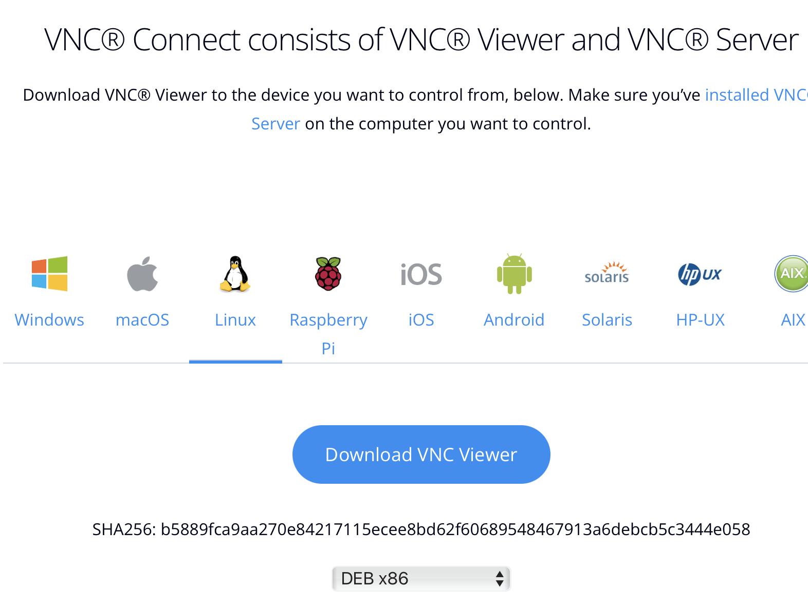
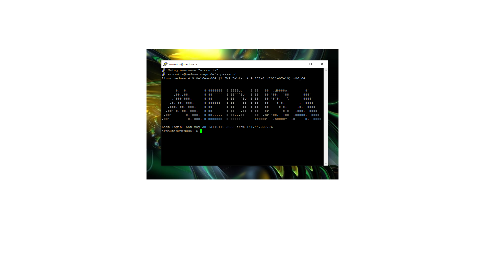
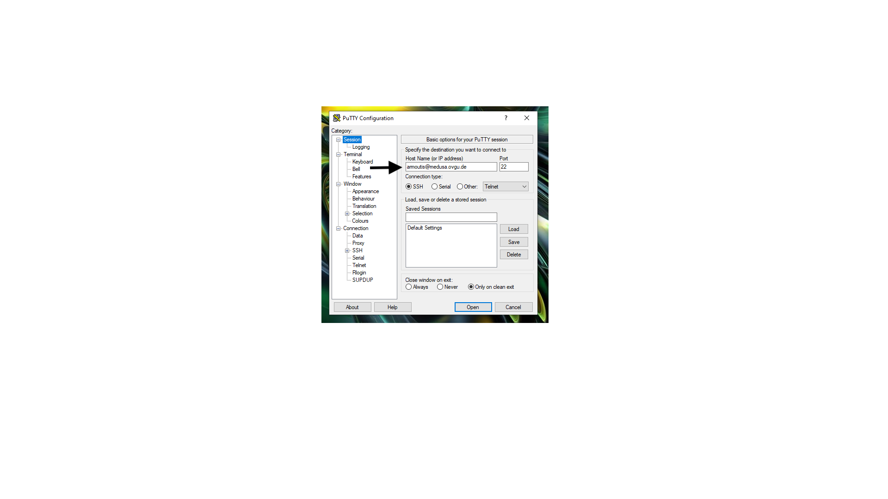
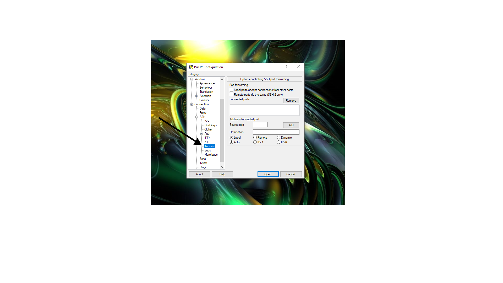
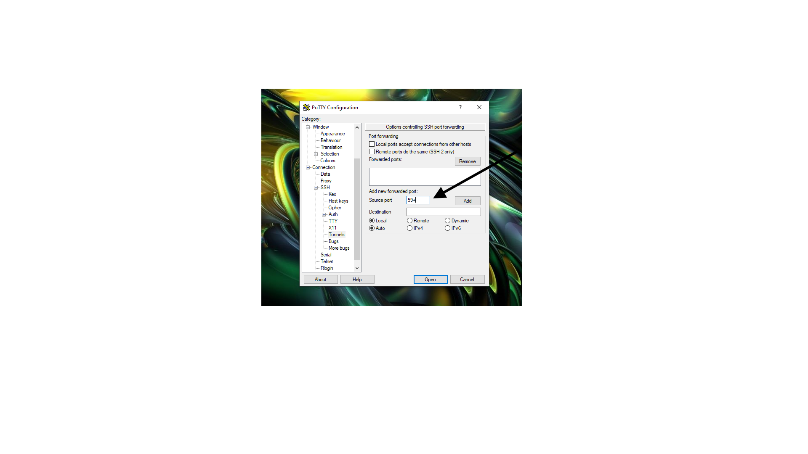
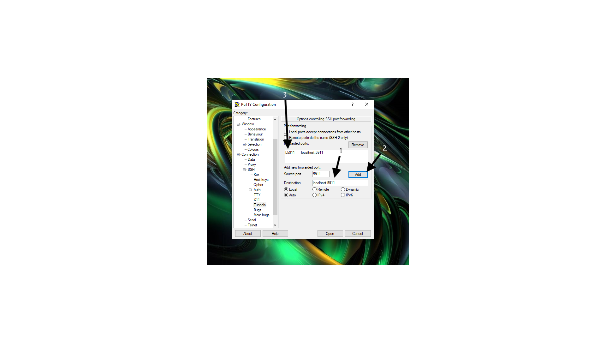
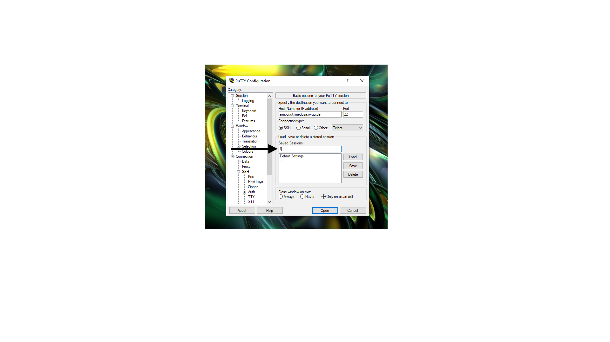
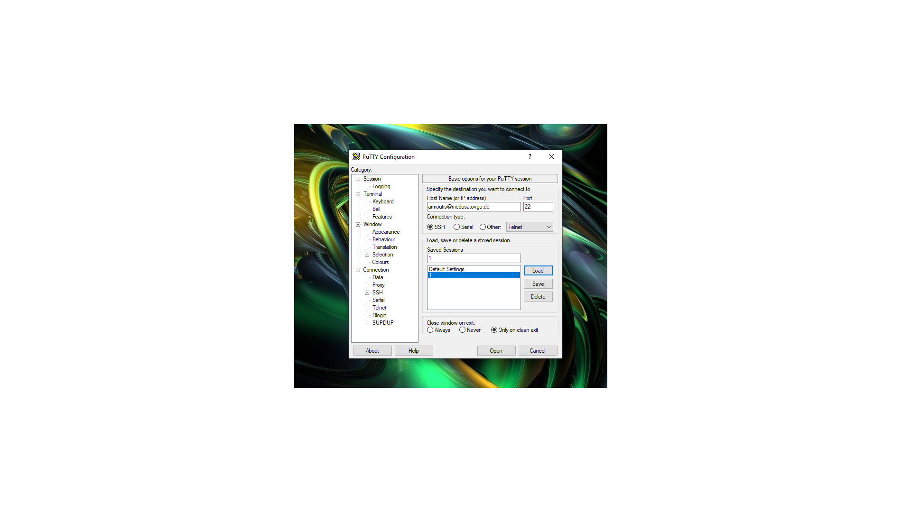
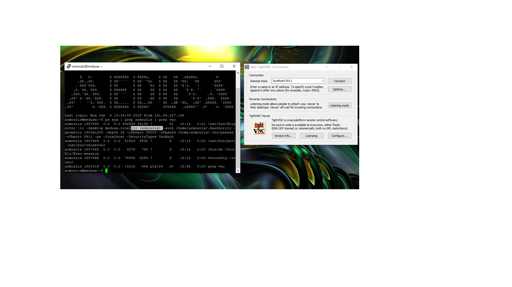

VNC on Linux/MacOS/Windows (with Putty) 
********

Download VNC Viewer to the device you want to control.

Make sure you have downloaded VNC® Connect to the computer you want to control.

Download VNC Viewer and VNC Connect, for Linux/MacOS/Windows,  and more ...

https://www.realvnc.com/de/connect/download/viewer/macos/

guter link fuer die installation linux, vncviewer, tightvnc und putty configuration: 

https://www.digitalocean.com/community/tutorials/how-to-install-and-configure-vnc-on-ubuntu-20-04-de

VNC on MacOS
*********

.. figure:: ./images/images_vnc/bar.png
    :name: bar.png
    :alt:  bar.png
    :align: center
    :width: 20%
    
find in the menubar the systemsettings
    
.. figure:: ./images/images_vnc/settings.png
    :name: settings.png
    :alt:  settings.png
    :align: center
    :width: 20%
    
find in the systemsettings the enable option
    
.. figure:: ./images/images_vnc/settings1.png
    :name: settings1.png
    :alt:  settings1.png
    :align: center
    :width: 20%
    
    find in the enable folder the line removed login
    
.. figure:: ./images/images_vnc/settings2.png
    :name: settings2.png
    :alt:  settings2.png
    :align: center
    :width: 20%
    
    Enter your password from your user and enable access to remote devices on both your and other systems via ssh
    
.. figure:: ./images/images_vnc/settings3.png
    :name: settings3.png
    :alt:  settings3.png
    :align: center
    :width: 20%
    
    Now it should be possible to use vnc Viewer 

VNC on Linux
****

configurate:

for Linux it is important to know the architektur from your hardware and the paketmanagersystem. 
It depend on which architektur you have you can install the right version. 
Choose between yout linux Distribution the right architektur and the right paketmanagersystem: 
rpm 
deb
arm
amd

Tipp: if you Download realVNCviewer, you must recognize and check the architektur from the paketmanager and the paket which you want to install

    
so decide wise.
    
.. figure:: ./images/images_vnc/architekturvnc1.png
    :name: architekturvnc1.png
    :alt:  architekturvnc1.png
    :align: center
    :width: 20%

VNC on Windows
**********
the installation is very straight forward. 

https://www.realvnc.com/en/connect/download/viewer/windows/

Putty on Windows/Linux/MacOS
**********
All pages and steps found detailed here: 

https://www.ssh.com/academy/ssh/putty/windows

And short here: 

Putty on Windows
**********

    
First Login to medusa Server. 

.. figure:: ./images/images_win_putty_vnc/first_vncpasswd.png
    :name: first_vncpasswd.png
    :alt:  first_vncpasswd.png
    :align: center
    :width: 50%
    
Then set the vnc server password with :

.. code::
    vncpasswd
    
    
.. figure:: ./images/images_win_putty_vnc/then_start_vncserver.png
    :name: then_start_vncserver.png
    :alt:  then_start_vncserver.png
    :align: center
    :width: 50%
    
    Then start the vnc Server with
    
.. code::
    vncserver
    
and remember your Session number you need it for the putty configuration 

Download Putty & then install it

https://www.chiark.greenend.org.uk/~sgtatham/putty/latest.html

1. Specify host name as your medusa login (name@medusa.ovgu.de) and Port 22
    
.. figure:: ./images/images_win_putty_vnc/SSH_knotenpunkt.png
    :name: SSH_knotenpunkt.png
    :alt:  SSH_knotenpunkt.png
    :align: center
    :width: 50%
    
    
find on the left side the SSH option
   

    
after that the ssh tunnels option

    
3. Type 59 + your session number for Source port (e.g. if your session number is 8 type 5908).
 
 

       
4. Type localhost:59(session number) as Destination then click Add. (e.g. localhost:5908)

  
  
5. Go back to session and you can save this session so you don’t have to repeat these steps each time you want to connect.

    
6. Load and open session and connect to medusa and start the VNC Server (after setting up your password)
   
   
   

    
7. Open a VNC Viewer, type localhost:59(session number) and connect.
  
  
.. figure:: ./images/images_win_putty_vnc/vncauthentication.png
    :name: vncauthentication.png
    :alt:  vncauthentication.png
    :align: center
    :width: 50%
    
    
8. You will be required to enter your VNC password, afterwards you will have access to the GUI.  
    
.. figure:: ./images/images_win_putty_vnc/youmadeit.png
    :name: youmadeit.png
    :alt:  youmadeit.png
    :align: center
    :width: 50%
    
    
you made it!
    
Putty on Linux
**********

install putty with these desription: 
https://numato.com/blog/how-to-install-putty-on-linux/

Step to Putty configuration below!

Problems on Linux 
******

Putty installation problems: 

define global Variable: by problems with putty on linux download.

eingeben in Terminal:

env GDK_BACKEND=x11 putty

Putty on MacOS
**********

Install Putty here: 

https://macresearch.org/putty-for-mac/

then -> configurate Putty: 

but before start the vnc Server see by medusa/access!!

A) PuTTY configuration: is an SSH telnet client which, with a VNC Viewer, connects to the GUI. The steps after downloading PuTTY is as follows:

      1. Specify host name as your medusa login (name@medusa.ovgu.de) and Port 22
      2. On the right hand side, click on the + next to SSH and then click Tunnels.
      3. Type 59 + your session number for Source port (e.g. if your session number is 8 type 5908).
      4. Type localhost:59(session number) as Destination then click Add. (e.g. localhost:5908)
      5. Go back to session and you can save this session so you don’t have to repeat these steps each time you want to connect.
      6. Load and open session and connect to medusa and start the VNC Server (after setting up your password)
      7. Open a VNC Viewer, type localhost:59(session number) and connect.
      8. You will be required to enter your VNC password, afterwards you will have access to the GUI.

    

Config & Settings 
******

In case of problems from too many started vncServers: 

Looks like this: 

.. figure:: ./images/images_problems/problems_vncserver.png
    :name: problems_vncserver.png
    :alt:  problems_vncserver.png
    :align: center
    :width: 20%

Killen von Prozessen auf dem Medusa Server, notwendig bei mehrfacher Anwendung von dem starten von vnc Servern: 

.. code::

ps aux | grep Benutzer | grep vnc

.. code::

vncserver -kill :9

.. code::

pkill -u Benutzer

----

Important to know: 
links for more understanding: 
